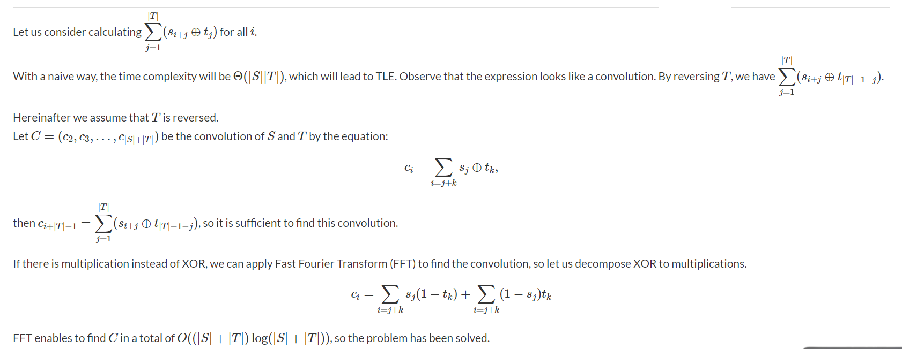

## Template
```c++
// FFT Template

const int   N   = 1 << 18; // depends on the modulo
const int   mod = 998244353; // for modulo like 1e9 + 7,use CRT

/* FFT section */
void add(int &a,int b)  {
    a += b;
    if (a >= mod) a -= mod;
}
void sub(int &a,int b)  {
    a -= b;
    if (a < 0) a += mod;
}
int mul(int a,int b)    {
    return  1ll * a * b % mod;
}

int binpow (int a,int b){
    int res = 1;
    while (b){
        if (b & 1) res = mul(res,a);
        a = mul(a,a);
        b >>= 1;
    }
    return res;
}

int inv (int a){
    return binpow(a,mod - 2);
}

typedef vector<int> poly;
int W[N],I[N];

void init_fft(){
    for (int i = 0 ; i < N ; i++){
        int exp = (mod / 2 / N) * i;

        W[i] = binpow(3,exp);
        I[i] = binpow(3,mod - exp - 1);
    }

}

void FFT (poly &a,bool invert){
    int n = a.size();
    for (int i = 0 ; i < n ; i++){
        int x = i;
        for (int j = 0 ,k = log2(n) - 1 ; j < k ; j++,k--){
            if ((x >> j & 1) != (x >> k & 1)){
                x ^= (1 << j);
                x ^= (1 << k);
            }
        }
        if (i < x) swap(a[i],a[x]);
    }

    for (int k = 1 ; k < n ; k <<= 1){
        for (int i = 0 ; i < n ; i += k + k){
            int idx = 0;
            int gap = N / k;

            for (int j = 0 ; j < k ; j++,idx += gap){
                int x = a[i + j];
                int y;
                if (invert){
                    y = mul(a[i + j + k],I[idx]);
                }
                else {
                    y = mul(a[i + j + k],W[idx]);
                }
                add(a[i + j],y);
                a[i + j + k] = x;
                sub(a[i + j + k],y);
            }
        }
    }

    if (invert){
        int m = inv(n);
        for (int &x : a){
            x = mul(x,m);
        }
    }
}

poly operator * (poly a,poly b){
    int n = a.size() + b.size() - 1;
    int m = (2 << (int)(log2(n)));

    a.resize(m);
    FFT(a,0);
    b.resize(m);
    FFT(b,0);

    for (int i = 0 ; i < m ; i++){
        a[i] = mul(a[i],b[i]);
    }

    FFT(a,1);
    a.resize(n);
    return a;
}
```
To use the above template just call the `init_tft()` function and use multiplication
operation as above.

## Application
### Exercise 1 : Atcoder ABC196F
Link : https://atcoder.jp/contests/abc196/tasks/abc196_f.

Brute-force solution
```c++
	ll ans = oo;
	for (int i = 0 ; i < s.size() && i + t.size() - 1 < s.size() ; i++){
		ll cost = 0;
		for (int j = 0 ; j < t.size() ; j++){
			if (t[j] != s[i]) cost++;
		}
		ans = min(ans,cost);
	}
	// Time complexity O(|S| * |T|)
```
We define cost[i] as the cost if we start from index i.
We can use FFT to reduce the time complexity to O((s + t) * log(s + t)).
Detailed Solution :



Submission : https://atcoder.jp/contests/abc196/submissions/25284257.

### Exercise 2 : RCC2015 - Round 1 - Hash
Link : http://www.russiancodecup.ru/en/tasks/round/35/E/.

```text
DP formulation :
dp[i][j] the number of segments with length 2^i have modulo j.

dp[i][j] -> dp[i + 1][j * 2^i + k] += dp[i][j] * dp[i][k].

Time complexity : O(M^2 * log)

=> We can use FFT to optimize it into O(M * log * log).
```


